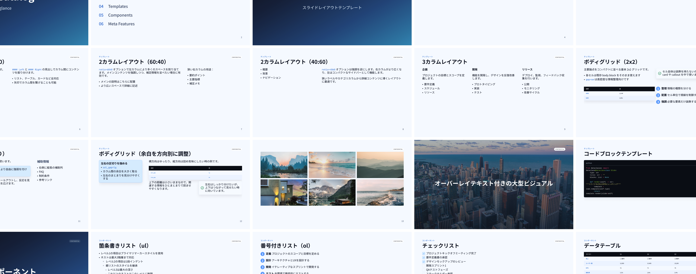

# Markdown to Figma Slides



English: this page / 日本語: [README.md](README.md)

Markdown to Figma Slides is a skill for turning Markdown into HTML slides and handing them off to Figma.  
The generated projects have versioned snapshots (`v1`, `v2`, ...) and can be operated while switching themes.  
The specifications and operational rules of this Skill are not contained solely in `SKILL.md`.  
They are composed as a whole, including supplementary documents such as `skills/references/workflow.md`.  
Therefore, when using it, please download the entire set of related files together rather than `SKILL.md` alone, and use them while maintaining the original folder structure.

## What This Repo Contains

- Skill definition: `skills/SKILL.md`
- Source of truth for workflow steps: `skills/references/workflow.md`
- Source of truth for Markdown syntax: `skills/references/markdown-mapping.md`
- Source of truth for Figma capture: `skills/references/figma-capture.md`
- Bundled scaffold: `skills/assets/project-template/`

The user-facing source of truth for theme-system operation is `skills/references/theme-system.md`. The maintainer-facing design record remains `docs/theme-design.md`.

## Quick Start

### Prerequisites

- Python 3.9 or newer must be available
- Figma MCP must be available if you want Figma capture
- Your AI coding agent must be able to access this repository

Automatic end-to-end Figma capture is intended for Claude Code. In Codex, the Figma capture step cannot currently be executed.

### Try It First

The easiest way to understand the output is to start with `skills/assets/sample-catalog.md` and generate a test project from it.

You can ask Claude Code, Codex, or another coding agent with a prompt like this:

```text
Use the sample-catalog.md file in this repository to create a test slide project and generate the slides. I want to quickly see what kind of slides this skill produces.
```

If you want a slightly more explicit version:

```text
Use skills/assets/sample-catalog.md to initialize a test project and generate slides from it. After that, tell me where I should look to review the output.
```

This helps you confirm:

- what the generated slides look like
- the feel of the built-in themes and templates
- how the workflow behaves before you use your own Markdown

## Prompt Examples

These examples are for real work once you want to use your own Markdown or adjust the design.

### Generate slides from your own Markdown

```text
I want to turn a Markdown file into slides.
```

### Generate slides from a specific input file

```text
Generate slides from input/raw/source.md.
```

### Generate first, then tune the design

```text
First generate the slides, then help me adjust colors and spacing.
```

### Go all the way through Figma capture

```text
Generate the slides and help me import them into Figma.
```

This prompt is intended for Claude Code. With Codex, you can still generate the slides, but the Figma capture step must be handled separately.

## Themes and Config

- The built-in themes are `classic`, `minimal`, and `gradient-blue`
- The active theme is selected by `design.config.yaml.theme.name`
- The baseline look should come from theme defaults
- `design.config.yaml` should only hold project-specific overrides

If you want to switch themes, you can ask with a prompt like this:

```text
Switch this slide project to the minimal theme and make it easy for me to review the updated look.
```

For user-facing theme-system rules, see `skills/references/theme-system.md`. For exact operational steps, see `skills/references/workflow.md`. Maintainer-facing design decisions remain in `docs/theme-design.md`.

## Project Scaffold at a Glance

```text
my-slides/
  design.config.yaml
  shared/
    styles/
      slide.css
  themes/
    <name>/
      theme.yaml
      styles/
      templates/
  scripts/
  input/
    raw/
    normalized/
    current.md
  output/
    vN/
      slides/
      source/
      SLIDES.md
      manifest.json
    slides.html
```

Rules for initialized projects are included in `skills/assets/project-template/CLAUDE.md`.

## Detailed Docs

| If you want to know about... | Read this |
| --- | --- |
| Initialization, generation, rerun decisions, and manual commands | `skills/references/workflow.md` |
| Markdown syntax, templates, and special comments | `skills/references/markdown-mapping.md` |
| Figma import and polling | `skills/references/figma-capture.md` |
| Theme-system operating rules | `skills/references/theme-system.md` |
| Adding or customizing built-in themes | `skills/references/theme-authoring.md` |
| Multi-theme visual verification | `skills/references/visual-qa.md` |
| Maintainer guidance for deciding change scope | `docs/maintainer-change-guide.md` |

## Troubleshooting

If Python dependencies are missing:

```bash
pip3 install jinja2 pyyaml pygments
```

If `scripts/` does not exist yet, the project has not been initialized.

```bash
./skills/scripts/init_project.sh /path/to/my-slides
```

If preview is not working:

```bash
cd /path/to/my-slides/output
python3 -m http.server 8080
```
